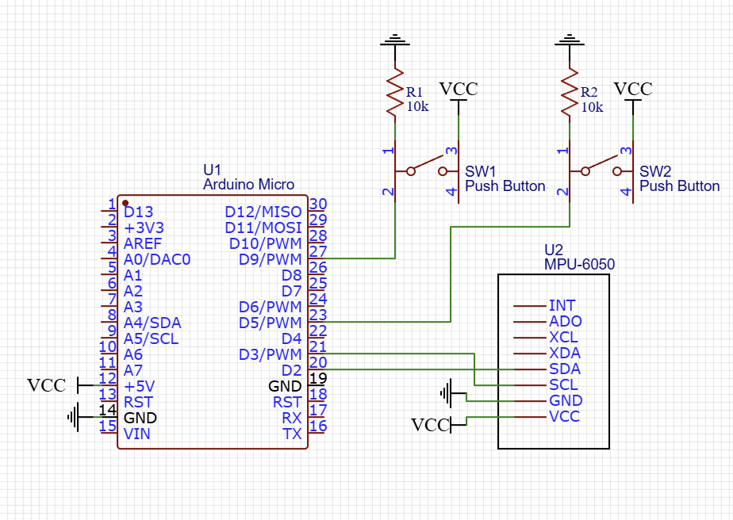

# Motion Controlled Mouse

A USB mouse controlled by angular movement, powered by Arduino. 

## Controls

The top push button acts as the left click. The bottom push button is the right click. Rotating the MPU6050 by the y Axis (as labeled on the component) moves the mouse in the x direction. Rotating the component on the x Axis moves the mouse in y direction. These orinteations are based on how my breadboard is laid out and will likely be different if you recreate this project. 

## Hardware

### Components

* __Arduino Micro__: Note that some other Arduino's might work but make sure they are compatible with the `Mouse.h` library. The Arduino Uno, Mega and Nano are not compatible. To my knowledge the Arduino Micro is the cheapest board that supports it. 
* __MPU6050 Accelerometer module__
* __Two push buttons__
* __Two 10k resistors__

### Schematic

Note that while the push button pins can be changed in code, the pins for the MPU-6050 are requried for I2C connection. 

## Calibrating

## Reference

The methods for filtering the data from the MPU are from [this repo](https://github.com/mattzzw/Arduino-mpu6050/tree/master?tab=readme-ov-file). Many thanks to the creator since filtering the MPU data was one of the most difficult portions of this project. 